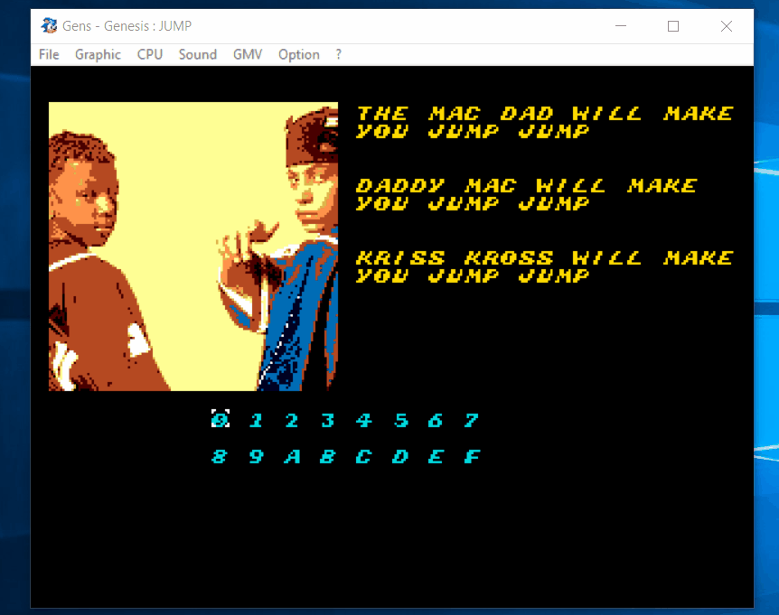

# jump

# Spoiler Alert!

If you are here to download and do the CTF problem (without viewing the source code),
download the jump.bin binary [here](bin/jump.bin)

# Description

Jump is a SEGA Genesis ROM capture the flag "crackme" with a Kriss Kross theme.
The objective is to reverse engineer the ROM enough to provide the correct
controller input to recover the embedded "flag". The flag is simply 
alphanumeric phrase with each word seperated by underscores. Good luck!

P.S. I will upload the source code in the future after it's been solved and
solutions become available online. (Or after I realize no one is going to
download it at all).

# Resources

* [Gens Kmod SEGA Emulator](https://segaretro.org/Gens_KMod)
* [GHIDRA SEGA Genesis ROM Loader](https://github.com/zznop/ghidra_scripts)
* [Binary Ninja 68000 Processor Module](https://github.com/alexforencich/binaryninja-m68k)
* [SEGA Megadrive/Genesis Documentation](https://segaretro.org/Category:Sega_Mega_Drive)

# License

This project is released under a [MIT](https://github.com/zznop/jump/LICENSE.md) license.
